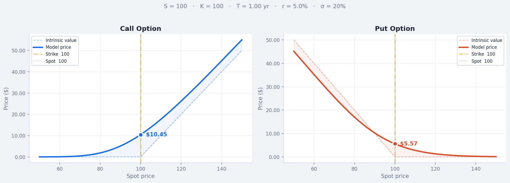
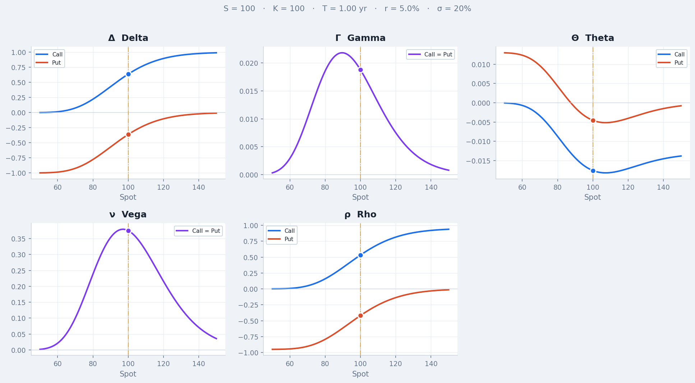
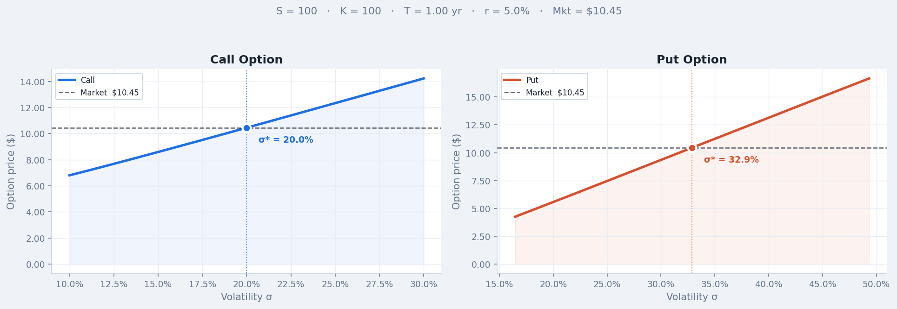
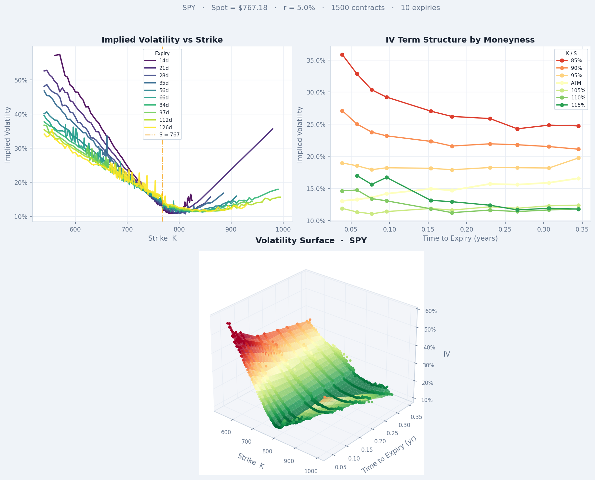

# Black-Scholes Options Pricing Library

This is a Black-Scholes options pricing library for European options. It presents interactive Jupyter dashboards for prices, Greeks and implied volatility, as well as a volatility surface built from live option chains.

## Features

- **Pricing:** Closed-form Black-Scholes prices for European calls and puts.
- **Greeks:** Analytic Δ, Γ, Θ (per day), ν (per 1% vol) and ρ (per 1% rate).
- **Implied Volatility:** Applies Newton-Raphson using analytic vega, with a bisection fallback when vega is too small for Newton to be stable. Returns `None` when no volatility can reproduce the price.
- **Market Data:** Pulls option chains from Yahoo Finance for SPY, QQQ, AAPL, NVDA, GLD, USO, TLT and FXE, solves IV for OTM contracts, and plots the smile, the term structure by moneyness and an interpolated 3D surface.

## Dashboards

| Pricer | Greek curves |
|---|---|
|  |  |

**Implied Volatility:** The solver finds σ where the model price curve crosses the market price.



**Volatility Surface:** SPY implied volatility from 1,500 out-of-the-money contracts across 10 expiries.



## Usage

```bash
pip install -r requirements.txt
jupyter notebook notebooks/black_scholes.ipynb
```

The dashboards use ipywidgets and need a running Jupyter kernel. GitHub's notebook preview shows the code but fails to display the widgets. The outputs can be viewed via the screenshots above.

```python
from src.models.black_scholes import BlackScholes, implied_vol

bs = BlackScholes(S=100, K=100, T=1.0, r=0.05, sigma=0.2)
bs.call_price()                                # 10.4506
bs.delta("call")                               # 0.6368
implied_vol(10.4506, 100, 100, 1.0, 0.05)      # 0.2000
```

## Tests

```bash
python -m pytest
```

The tests check prices against a textbook reference value, put-call parity across strikes, maturities and volatilities, Greeks against a central finite difference, and implied volatility round-trips (price → IV → price). Round-trip cases with under $0.01 of time value are skipped.

## Limitations

- **No dividends.** Index and equity underlyings pay dividends, which lowers the forward price. The volatility surfaces ignore the dividend yield, thereby biasing put IVs upward and call IVs downward.
- **European model on American options.** The US equity options used can be exercised early. However, the volatility surface uses only OTM contracts, for which the effect is small.
- **Flat risk-free rate.** The risk-free rate is a user input and is not taken from the Treasury curve for each maturity.
- **Quote quality.** Mid-prices from Yahoo Finance can be stale outside market hours, and sparse far-OTM strikes can make individual smile curves jagged.
